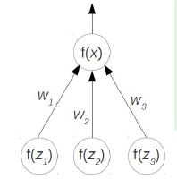
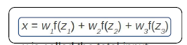
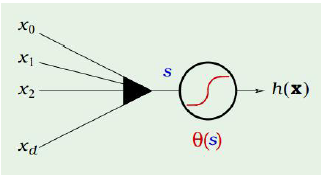
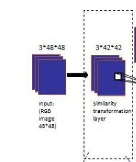
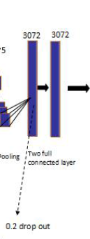

# 深度卷积神经网络原理与实践
***

## 一、数据基本流程
原始输入预处理（去噪）-> 提取特征（特征抽取、降维） -> 使用模型进行学习

### 如何得到特征
通过神经网络来模拟人的大脑的构造的学习过程，希望通过模拟人的大脑的多层抽象机制来实现对数据的抽象表达
***

## 二、深度学习模型
	
### 2.1. 感知机（Perceptrons）

### 2.2. 支持向量机(Support  Vector Machines)
1）在线性分类上效果出众，但非线性分类的学习成本高
2）并行化不好
3）维度爆炸，且核函数不好解

### 2.3. 深度神经网络（Deep Neural Networks）
#### 1.结构
1）前馈神经网络（线性变换、逐个量的非线性变换）
2）分类/回归模型（线性回归、Softmax、SVM等）

#### 2.神经元和神经网络
1）神经元

2）理论证明
通过三层以上的神经网络，可以拟合任意的线性和非线性组合。

3）缺点
可能出现过拟合（为解决这一问题出现了卷积神经网络）

#### 3.卷积神经网络（Convolution Neural Network）
1）卷积层 （Convolution Layer）— 特征提取
2）子采样层（Polling Layer） — 平移、倾斜不变性
3）网络特点：稀疏连接 + 权值共享

#### 4.CNN的求解
1）定义：
* 输入向量为样本**X**，标签为y
* 输出向量为**h(X)**
* 定义e(**h(x)**， y) = e(**W**)

2）神经元和激活函数 $\theta(s)$
$s = x_{0} \times w_{0} + x_{1} \times w_{1} + \dots + x_{d} \times w_{d}$

3）模型目的为让e(**W**)达到最优。如回归模型中：
$e(W) = e(h(x), y) = (h(x) - y) ^2$

4）模型构架是经验主义，无法证明

####5.提高识别准确度技巧
1）数据的扰动

2）Dropout

3）优化算法选择
4）直觉和经验主义 -> 理论证明
5）通过代码学习
